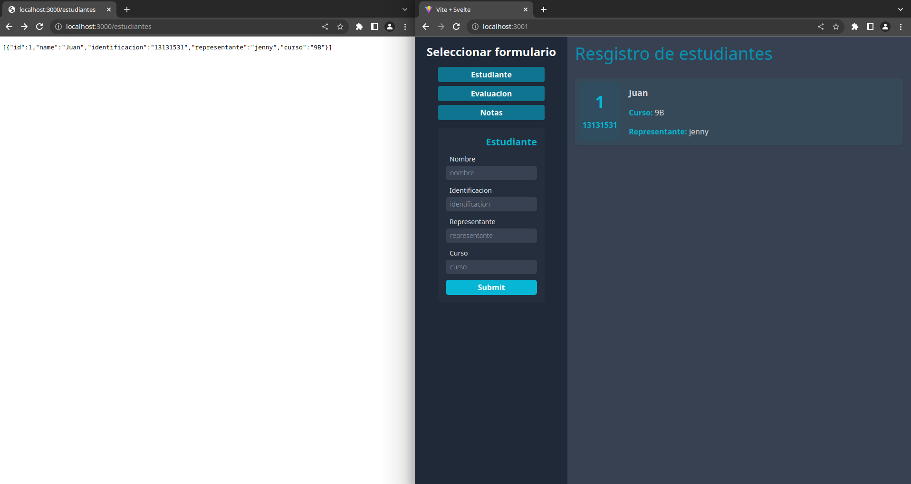
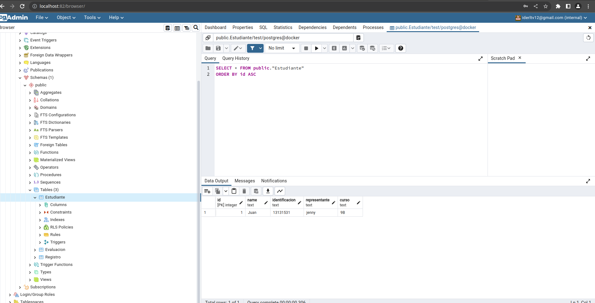
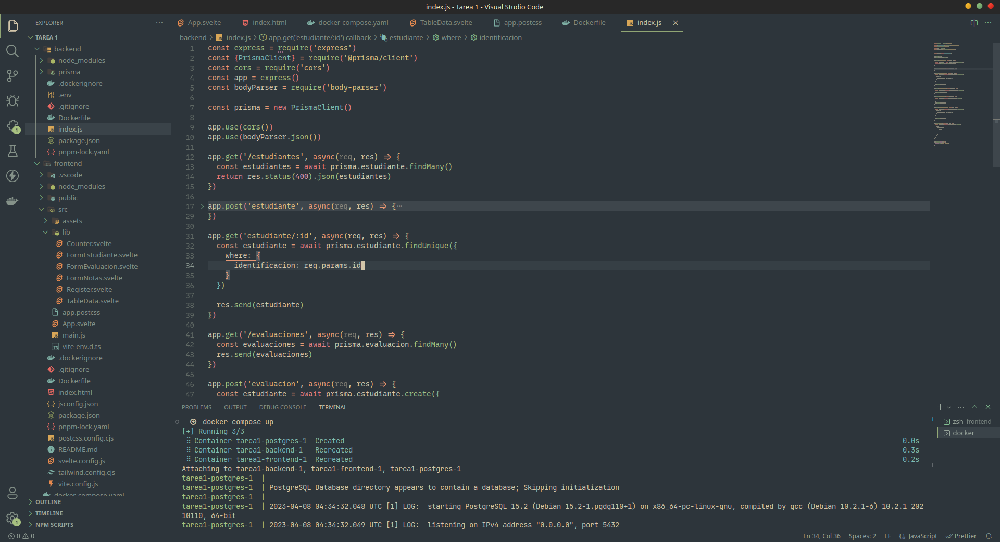
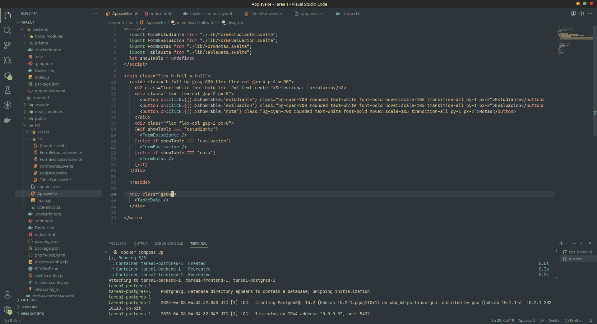
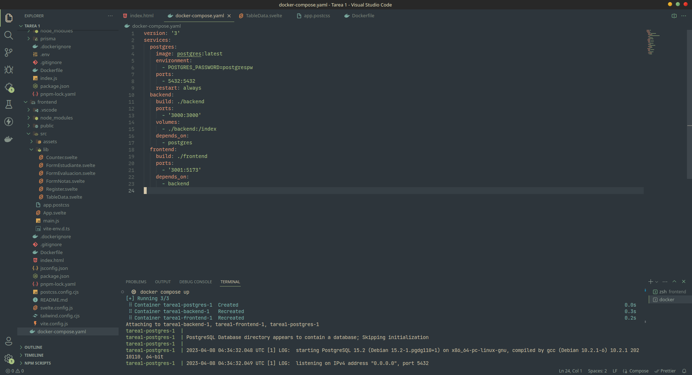

# Capturas de evidencia

## Resultados
Se muestra en la izquierda el backend expuesto en el puerto 3000 y en el frontend se expone internamente en el puerto 5173 y en la maquina en el puerto 3001.

## Base de datos

### Backend (rest api)

### Frontend (desarrollado svelte)

### Docker compose

