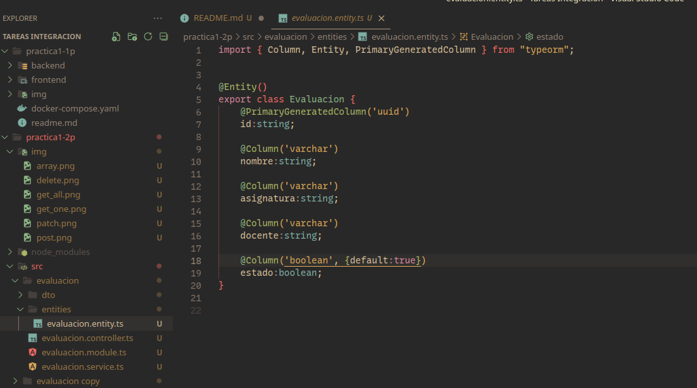
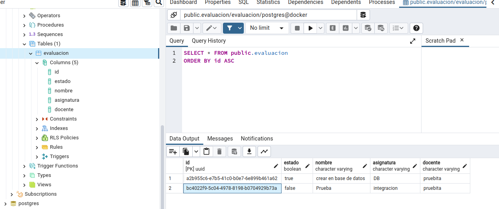
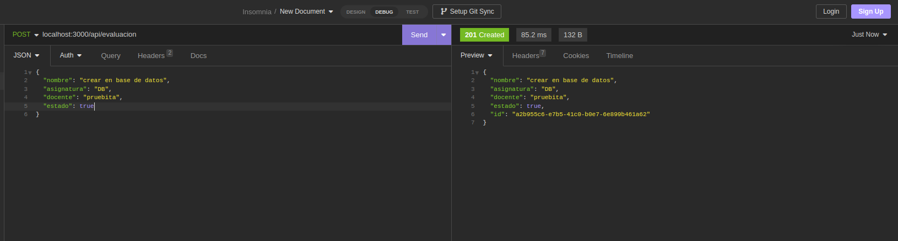
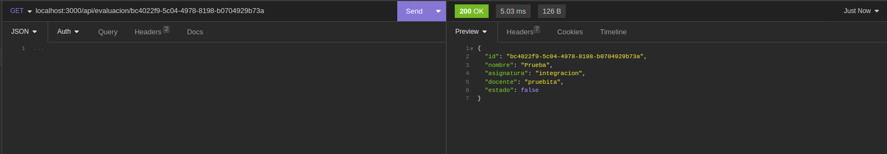
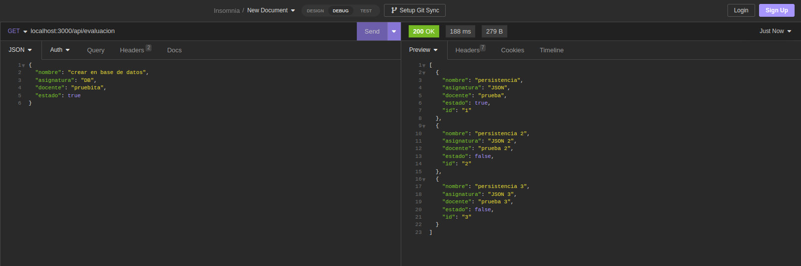
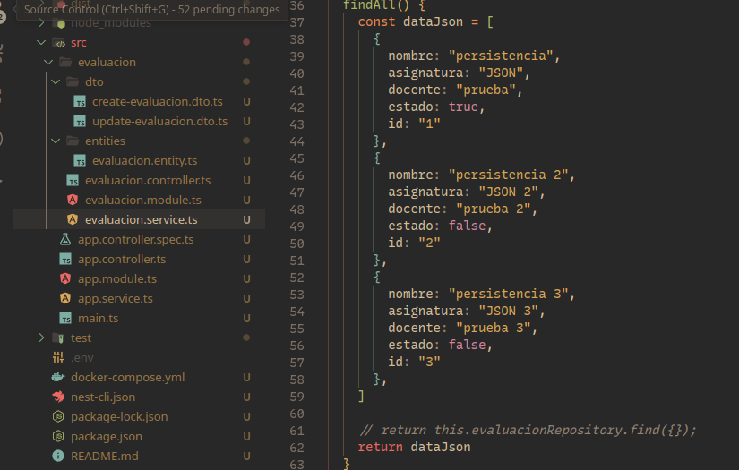
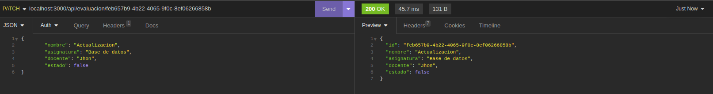
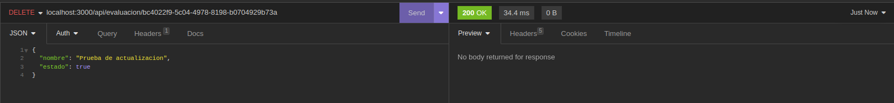

# Capturas de evidencia

## PRACTICA 1 DEL 2 PARCIAL

### EVIDENCIAS

Se utilizo la entidad de evaluaciones como entidad maestra para el desarrollo de esta practica



Comprobacion de la creacion de la base de datos y sus tabla en postgresql


### REST API

- #### POST
  ```
    POST /api/evaluacion
  ```
  
- #### GET (ONE)

  ```
    GET /api/evaluacion/:ID
  ```

  

- #### GET (ALL)

  ```
    GET /api/evaluacion
  ```

  
  en este metodo se utilizo un array de objetos como datos, implementado en evaluacion.servicio
  

- #### PATCH

  ```
    PATCH /api/evaluacion/:ID
  ```

  

- #### DELETE
  ```
    DELETE /api/evaluacion/:ID
  ```
  
