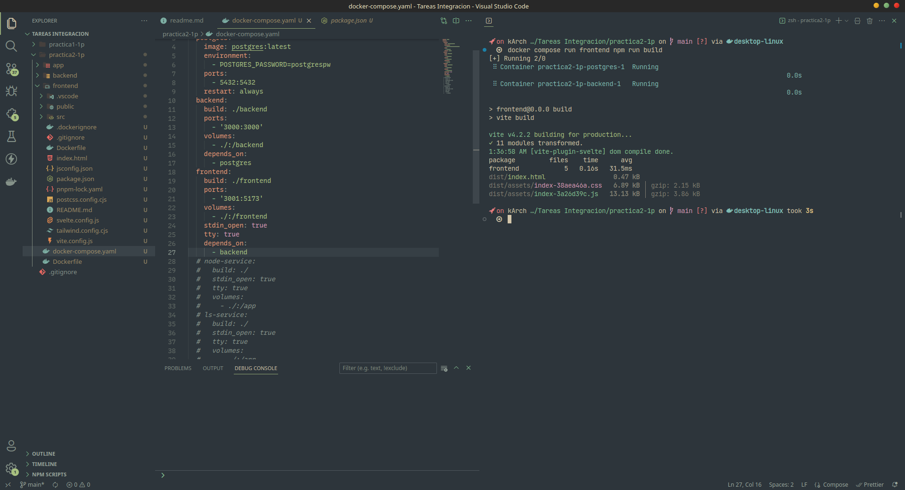
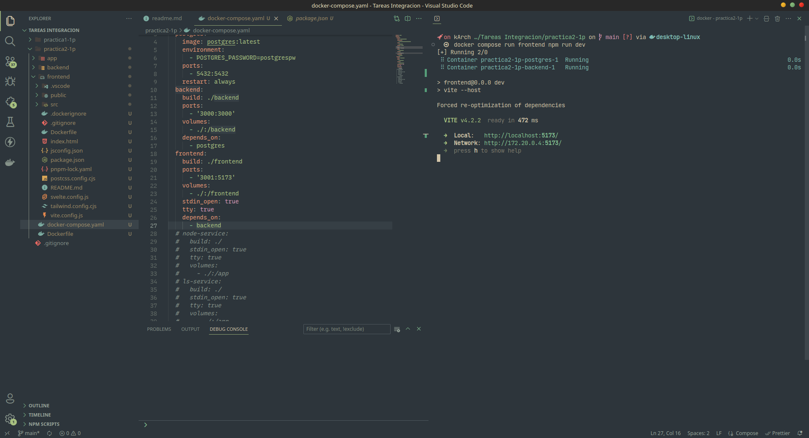
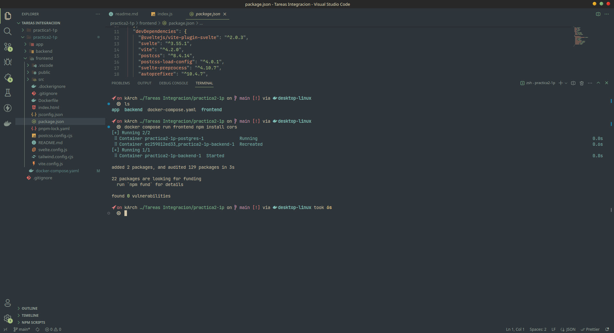
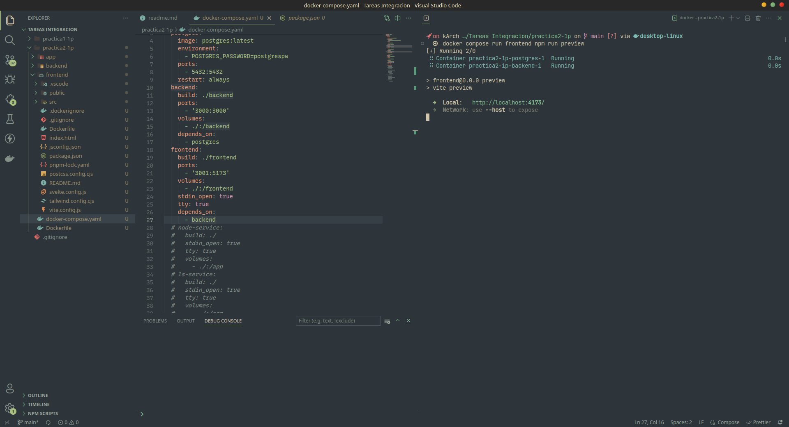
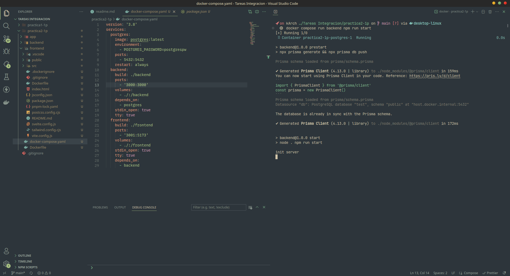

# Taller 2-1p

Comandos usados para interactuar con los contenedores

### comandos usados

```
  docker compose run frontend npm run build
```


```
  docker compose run frontend npm run dev
```


```
  docker compose run frontend npm run install
```


```
  docker compose run frontend npm run preview
```


```
  docker compose run backend npm run start
```
