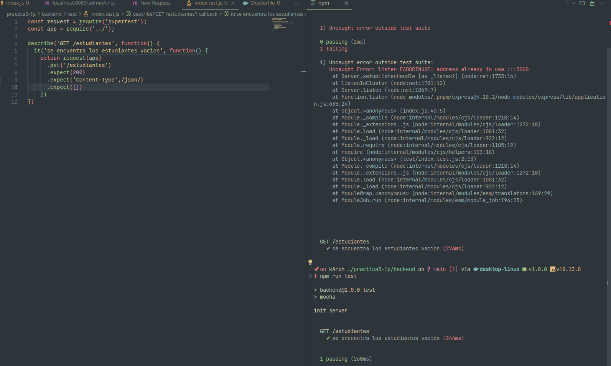

# PRACTICA 3 - 1 PARCIAL

## 1. Rest api
Probrar el funcionamiento de la rest api del metodo GET y POST
##### GET

##### POST


## 2. Prueba unitaria
funcionamiento de una prueba unitaria con realizar con mocha y funcionando sobre el metodo GET


## 3 - 4. Tags sobre el servicio Rest
Crear un nuevo tag para empaquetar el servicio rest una imagen de docker donde el parametro -t especificar el tag despues del [nombre]:2.0.0
```
  docker build -t practica3:2.0.0
```


Se puede observar la imagen y los tags creados con el comando
```
  docker images
```


Una vez creado el tag se puede llegar a ejecutar la imagen creada usando el tag para diferenciar las dos versiones creadas
el paramatro -p sirve para usar y comunicar los puertos y tener acceso a la maquina de ambos lados
```
  docker run -p 127.0.0.1:3000:3000 practica3:2.0.0
```


## 5. Subir a docker hub
usar un tag para un repositorio creado en docker hub con un tag que sera mostrado al descargar la imagen
```
  docker tag practica3:1.0.0 leonardotv/practica-integracion:v1
```

Seleccionar cual imagen se subira al repositorio de docker hub
```
  docker push leonardotv/practica-integracion:v1
```


## 6. Probar en local
buscar y descargar de docker hub el repositorio y ejecuar la aplicacion

Mostrar el funcionamiento de la aplicacion rest con una base de datos postgresql desde una imagen de postgres

